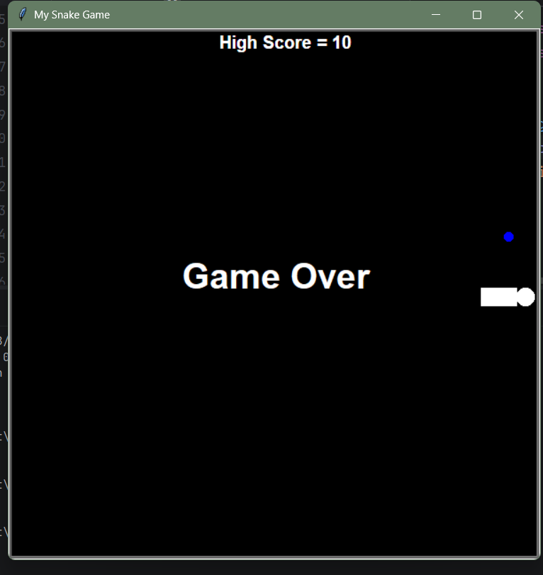

# Snake Game

This is a simple Snake Game built using Python and the Turtle graphics module. I made this project mainly while learning Python, especially to practice Object Oriented Programming concepts in a fun and practical way. If you are also someone learning Python, this project can help you understand how a small game is structured using classes and objects.

## About the Project

The classic Snake Game where the player controls a snake using the keyboard. The snake moves around the screen and tries to eat the food that appears randomly. Each time the snake eats the food, the score increases and the snake grows longer. If the snake hits the wall or hits itself, the game ends and shows a Game Over screen along with the high score.

The high score is stored in a text file so that it stays saved even after the game is closed and reopened.

## Project Structure

The project is divided into different files, with each file handling one part of the game. This is one of the main ideas of Object Oriented Programming, where we break a big problem into smaller parts and handle each part using separate classes.

main.py
This is the main file that runs the game. It creates the screen, creates objects of the Snake, Food and Scoreboard classes, and controls the game loop. It also handles keyboard input for moving the snake and checks for collisions.

snake.py
This file contains the Snake class. It is responsible for creating the snake body, moving the snake, adding new segments when the snake eats food, and changing direction based on user input.

food.py
This file contains the Food class. It is responsible for creating the food object and placing it at random positions on the screen whenever the previous food is eaten.

score.py
This file contains the Scoreboard class. It is responsible for displaying the current score and the high score on the screen, updating the score when food is eaten, and showing the Game Over message when the game ends.

data.txt
This is a simple text file used to store the high score value. The Scoreboard class reads from this file when the game starts and writes to it whenever a new high score is achieved.

## Object Oriented Programming Concepts Used

This project is a good example for understanding basic OOP concepts in Python.

Classes and Objects
Each part of the game, the snake, the food and the scoreboard, is represented as a class. In main.py, objects of these classes are created and used together to run the game.

Inheritance
The Snake, Food and Scoreboard classes inherit from the Turtle class provided by the turtle module. This means each of these classes automatically gets all the properties and methods of a turtle, like shape, color and movement, and then adds its own extra features on top of that.

Encapsulation
Each class keeps its own data and methods together. For example, the Snake class manages its own list of body segments and movement logic, and the Scoreboard class manages its own score variable and file handling, without other parts of the code needing to know the internal details.

Method Overriding and Customisation
The classes customise the default turtle behaviour. For example, the Scoreboard class changes the default writing style, position and color of the turtle to display text instead of drawing shapes, which shows how inherited behaviour can be modified for a specific purpose.

Constructors
Each class uses the __init__ method to set up the initial state when an object is created, such as setting the starting shape, color, position and initial values for the snake, food and score.

## How to Run the Project

Step 1
Make sure Python is installed on your system. You can check this by typing python --version in the command prompt or terminal.

Step 2
Download or clone this repository to your computer.

Step 3
Open the project folder in your code editor, for example VS Code or PyCharm.

Step 4
Open a terminal in the project folder and run the following command

python main.py

Step 5
A new window will open showing the game screen. Use the arrow keys on your keyboard to control the direction of the snake, up, down, left and right.

Step 6
Try to eat the white food that appears on the screen. Each time you eat it, your score increases by one and the snake grows longer.

Step 7
If the snake touches the wall or touches its own body, the game will end and a Game Over message will be displayed along with your high score.

## Screenshots

Add a screenshot of the game window here showing the Game Over screen and the score, similar to the one shown during testing.

To add a screenshot, take a screenshot of the running game, save it inside the project folder, for example as screenshot.png, and then add the following line in this file

## What I Learned From This Project

While building this project I got a good understanding of how Python classes work together in a real application. I learned how to use inheritance with the turtle module, how to manage game state, how to read and write data to a file for storing the high score, and how to structure a project into multiple files instead of writing everything in one place. This project helped me move from just learning the theory of OOP to actually applying it in a small but complete program.

## Future Improvements

Some ideas to improve this project further include adding sound effects when the snake eats food or when the game ends, adding different levels of difficulty with varying speed, adding a pause and resume feature, and creating a proper start screen before the game begins.

## Author

This project was created by Alan Joseph as part of personal learning in Python and Object Oriented Programming.
